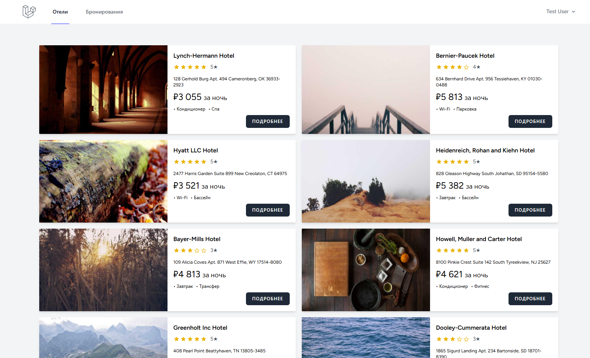
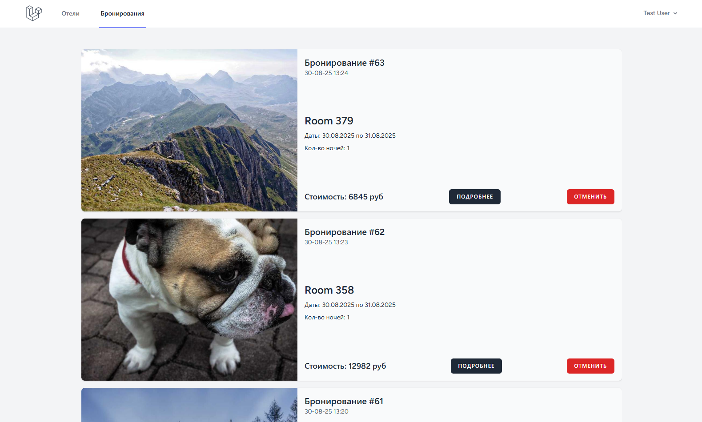
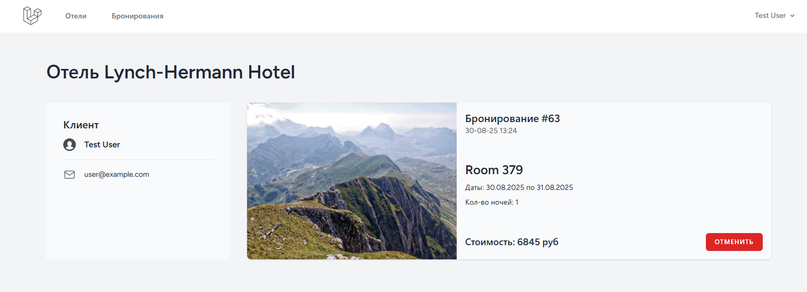
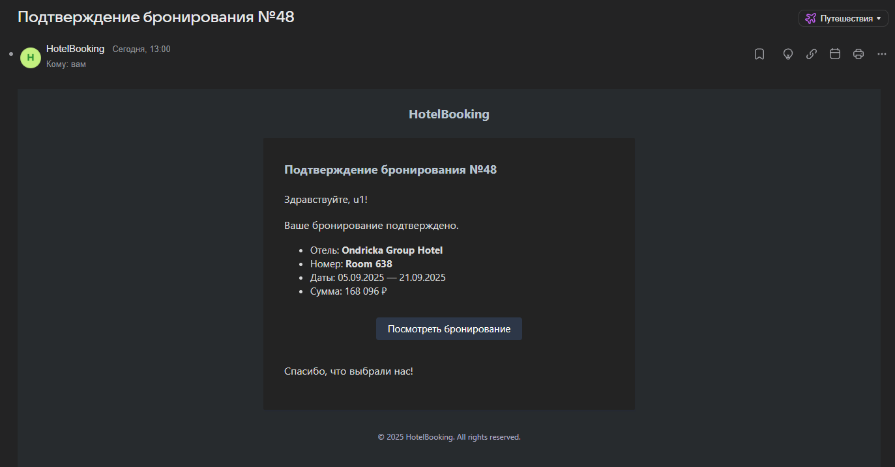

Hotel Booking (Laravel)

Онлайн-платформа для бронирования отелей: поиск, просмотр, бронь, email-уведомления. Проект сделан на Laravel с использованием Blade-компонентов, Breeze (аутентификация), Tailwind CSS и Alpine.js.

## Скриншоты

### Главная

### Карточка отеля

### Бронирование

### Карточка бронирования

### Пример письма в почте

# Возможности:
-Список отелей и карточка отеля

-Поиск доступных номеров по датам (без пересечений)

-Бронирование номеров авторизованными пользователями

-Список/страница бронирований пользователя, отмена брони
-Email-уведомления: подтверждение, отмена, напоминание перед заездом
-Роли: admin, user (будет добавлена роль manager для конкретного отеля)
-Локализация (RU/EN), Blade-компоненты и шаблоны
-Комментарии в коде: поясняют, что и где происходит
-Roadmap: система отзывов (форма/листинг/модерация), MoonShine-админка, роль «менеджер отеля», автотесты (80%+), доп. фильтры поиска.

Быстрый старт
1) Клонирование и установка
git clone <ваш-репозиторий> hotel-booking
cd hotel-booking

PHP-зависимости
composer install

Скопировать env и сгенерировать ключ приложения
cp .env.example .env
php artisan key:generate

2) Настройка XAMPP(или другой бд)
-В XAMPP запустите Apache и MySQL. Создайте БД (например, hotel_booking).
-В .env пропишите доступы:

APP_NAME="HotelBooking"
APP_ENV=local
APP_DEBUG=true
APP_URL=http://127.0.0.1:8000
APP_LOCALE=ru
APP_FALLBACK_LOCALE=en

DB_CONNECTION=mysql
DB_HOST=127.0.0.1
DB_PORT=3306
DB_DATABASE=hotel_booking (ваше имя бд)
DB_USERNAME=root
DB_PASSWORD=

3) Почта (email-уведомления)
Я использовал яндекс можно другого SMTP:

-MAIL_MAILER=smtp
-MAIL_HOST=smtp.yandex.ru
-MAIL_PORT=465          # или 587
-MAIL_USERNAME=имя реальной пачты
-MAIL_PASSWORD=******** # пароль приложения
-MAIL_ENCRYPTION=ssl    # для 465 → ssl, для 587 → tls
-MAIL_FROM_ADDRESS=имя реальной пачты
-MAIL_FROM_NAME="${APP_NAME}"

(В настройках Яндекс.Почты создайте пароль приложения для почтового клиента.
Подставьте его в MAIL_PASSWORD)

Для реальной отправки укажите SMTP вашего почтового провайдера.
Для отладки можно использовать MAIL_MAILER=log — письма будут писаться в storage/logs/laravel.log.

4) Миграции + сиды (одной командой)
php artisan migrate --seed
# или для полного пересоздания
php artisan migrate:fresh --seed

-Сиды создают:
-админа: admin@example.com / password
-пользователя: user@example.com / password
-несколько отелей, комнат, удобств, а также бронирования без пересечений

Можно изменить под ваши удобства файл DatabaseSeeder.php и файлы в директории factories

⚠️ Чтобы письма реально приходили — замените email пользователя в DatabaseSeeder на ваш рабочий адрес (или создайте нового пользователя через регистрацию). В сидере есть комментарий-намеки, куда подставить.

5) Фронтенд (Tailwind + Alpine)
Проект собирает resources/css/app.css (Tailwind) и resources/js/app.js (Alpine).
# Установить Node-зависимости
npm install
# Сборка на время разработки (watch)
npm run dev
# или продакшн-сборка
npm run prod

Если хотите самый простой старт, можно временно подключить Tailwind через CDN:
в <head> добавить

Но в проекте уже настроена сборка — рекомендую пользоваться ей.

6) Запуск приложения
php artisan serve
# Откройте: http://127.0.0.1:8000

7) Планировщик (напоминания о заезде)
-В bootstrap/app.php запланирована команда notifications:send-reminders каждые 15 минут.
-Для локалки просто запустите воркер планировщика в отдельном окне:

-php artisan schedule:work

-Альтернатива (Linux/WSL/macOS): добавить cron с * * * * * php /path/to/artisan schedule:run >> /dev/null 2>&1.

Как это всё работает?
# Основные URL:
/ — приветственная страница
/hotels — список отелей
/hotels/{hotel} — карточка отеля + выбор дат + доступные номера + (скоро) отзывы
/bookings — мои бронирования (только для авторизованных)
/booking/{id} — детальная страница брони
/register, /login — регистрация и вход (Laravel Breeze)

# Бронирование:
-На странице отеля выбираете даты → система покажет только свободные номера (внутри фильтра исключаются пересекающиеся брони).

-После бронирования отправляется письмо подтверждения.

-За день до заезда планировщик отправит напоминание (если schedule:work работает).

-Отменить бронь можно до даты заезда — придёт письмо об отмене.

# Почта: как проверить:
Настройте SMTP (Mailtrap) в .env.
-Залогиньтесь под почтой user'a реальной! или зарегистрируйте нового пользователя с вашим реальным email.
-Сделайте бронь — получите письмо подтверждения.

-Для напоминания можно временно вручную подвинуть started_at на завтра или запустить сидер так, чтобы создались будущие брони; планировщик отправит письма тем, у кого remind_at «попадает» в ближайший час.

# Технологии:
-Laravel (MVC, Eloquent ORM, Policies)
-MySQL (через XAMPP)
-Laravel Breeze (аутентификация, готовые формы)
-Blade компоненты (кнопки, карточки, список номеров/броней и т. д.)
-Tailwind CSS, Alpine.js
-Email через Laravel Mailables

# Структура и компоненты:
-resources/views/layouts — базовые лейауты (app, guest, navigation)
-resources/views/components — переиспользуемые элементы:
-button, link-button, nav-link, the-button, stars и др.
-bookings/booking-card, hotels/hotel-card, rooms/room-list-item
-resources/views/hotels — список и карточка отеля (+ блок отзывов)
-resources/views/bookings — мои брони и детальная
-resources/lang/ru.json и resources/lang/en/* — локализация строк интерфейса
и.т.д

# В коде много комментариев — они объясняют, что происходит (полезно при проверке).

# Политики, роли, безопасность
-Роли: admin, user (сидер создаёт обе)
-Policies ограничивают доступ (просмотр своих броней, отмена, и т. д.)
-Пароли хэшируются, CSRF включён

Для писем и планировщика используются стандартные механизмы Laravel

Полезные команды:
# Миграции/сиды
php artisan migrate --seed
php artisan migrate:fresh --seed

# Сервер разработки
php artisan serve

# Планировщик (локально)
php artisan schedule:work

# Сборка фронтенда
npm run dev
npm run prod

### Что дальше (Roadmap):

✅ Отзывы: модели/миграции/политики — в процессе, будет форма и список отзывов, средняя оценка на карточке отеля

🛠 MoonShine Admin: ресурсы для Hotel/Room/Facility/Booking/Review, ролевая модель

🧑‍💼 Роль менеджера отеля: управление одним отелем/его контентом

🔔 Система уведомлений: изменение резервации, напоминания

✅ Автотесты: покрытие 80%+ (feature + unit), проверка контента

🔎 Фильтры: по цене/удобствам/звёздам

🌐 Локализация: доработка переводов (ru/en), переключатель

# вопросы? 

Tailwind не применился?
запустили npm run dev?

Письма не приходят?
Проверьте SMTP в .env, и что вы используете реальный почтовый ящик у текущего пользователя. Для отладки поставьте MAIL_MAILER=log(необяхательно).

Напоминания не отправляются?
Нужно запустить php artisan schedule:work в отдельном терминале.

Локализация на русском?
Поставьте APP_LOCALE=ru и, при необходимости, APP_FALLBACK_LOCALE=en. Вьюхи используют __('...'), строки есть в resources/lang.

Если что-то не запускается локально — проверьте версии PHP (совместимы с вашей версией Laravel) и node, права на storage/ и bootstrap/cache/, и что APP_URL указывает на ваш локальный адрес. Приятной разработки! 🚀
